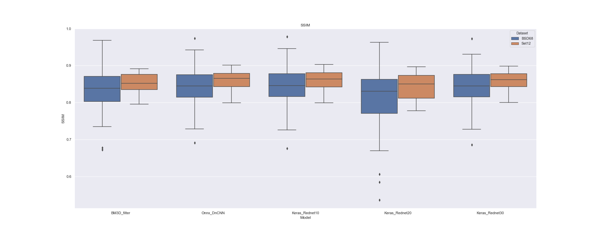

Example: running evaluation
===========================

Here we present a tutorial on how you can use the OpenDenoising benchmark to compare the performance of denoising
algorithms. You can run through this examples running the code snippets sequentially.

First, being on the project's root, you need to import the modules provided by the OpenDenoising benchmark:

.. code-block:: python

    from OpenDenoising import data
    from OpenDenoising import model
    from OpenDenoising import evaluation
    from OpenDenoising import Benchmark

To execute multiple models that access the GPU, you need to allow Tensorflow/Keras to allocate memory only when
needed. This is done through,

.. code-block:: python

    import keras
    import tensorflow as tf

    # Configures Tensorflow session
    config = tf.ConfigProto()
    config.gpu_options.allow_growth = True
    session = tf.Session(config=config)
    keras.backend.set_session(session)

The rest of the tutorial is divided as follows,

Defining Datasets
^^^^^^^^^^^^^^^^^

To define a dataset to evaluate your algorithms, you need to have at hand saved image files in the following folder
structure:

**Clean Dataset (only references)**

.. code-block::

    DatasetName/
    |-- Train
    |   |-- ref
    |-- Valid
    |   |-- ref

**Full Dataset (references and noisy images)**

.. code-block::

    DatasetName/
    |-- Train
    |   |-- in
    |   |-- ref
    |-- Valid
    |   |-- in
    |   |-- ref

To run this example, you can use the :py:mod:`data` module to download test datasets,

.. code-block:: python

    data.download_dncnn_testsets(output_dir="./tmp/TestSets", testset="BSD68")
    data.download_dncnn_testsets(output_dir="./tmp/TestSets", testset="Set12")

This snippet will create the entire folder structure for these two test datasets. To actually create the object for
generating image samples, you can use the following,

.. code-block:: python

    # BSD Dataset
    BSD68 = data.DatasetFactory.create(path="../../tmp/TestSets/BSD68/",
                                       batch_size=1,
                                       n_channels=1,
                                       noise_config={data.utils.gaussian_noise: [25]},
                                       name="BSD68")
    # Set12 Dataset
    Set12 = data.DatasetFactory.create(path="../../tmp/TestSets/Set12/",
                                       batch_size=1,
                                       n_channels=1,
                                       noise_config={data.utils.gaussian_noise: [25]},
                                       name="Set12")
    datasets = [BSD68, Set12]

Defining Models
^^^^^^^^^^^^^^^

**Deep Learning Models**

In "./Additional Files", you have at your disposal various pre-trained models. To load them, you only need to specify
the path to the file containing their architecture/weights. For more details about how the model module works, you can
look the Model module tutorial.

Bellow, we charge each model using the respective wrapper class for its framework.

.. code-block:: python

    # Keras rednet30
    keras_rednet30 = model.KerasModel(model_name="Keras_Rednet30", logdir="../../training_logs/Keras")
    keras_rednet30.charge_model(model_path="./Additional Files/Keras Models/rednet30.hdf5")

    # Keras rednet20
    keras_rednet20 = model.KerasModel(model_name="Keras_Rednet20", logdir="../../training_logs/Keras")
    keras_rednet20.charge_model(model_path="./Additional Files/Keras Models/rednet20.hdf5")

    # Keras rednet10
    keras_rednet10 = model.KerasModel(model_name="Keras_Rednet10", logdir="../../training_logs/Keras")
    keras_rednet10.charge_model(model_path="./Additional Files/Keras Models/rednet10.hdf5")

    # Onnx dncnn from Matlab
    onnx_dncnn = model.OnnxModel(model_name="Onnx_DnCNN")
    onnx_dncnn.charge_model(model_path="./Additional Files/Onnx Models/dncnn.onnx")

**Filtering Models**

The specification of filtering models is made the same way. Since these kinds of model do not need to be trained, you
only need to specify the function that will perform the denoising. Bellow, we specify BM3D implemented on Python through
Matlab's engine.

**Note** If you have not installed Matlab support, or have not installed BM3D library from `the author's website
<http://www.cs.tut.fi/~foi/GCF-BM3D/>`_, do not execute the next snippet.

.. code-block:: python

    # BM3D from Matlab
    bm3d_filter = model.FilteringModel(model_name="BM3D_filter")
    bm3d_filter.charge_model(model_function=model.filtering.BM3D, sigma=25.0, profile="np")

**List of Models**

If you have instantiated BM3D model,

.. code-block:: python

    models = [bm3d_filter, onnx_dncnn, keras_rednet10, keras_rednet20, keras_rednet30]

Otherwise,

.. code-block:: python

    models = [onnx_dncnn, keras_rednet10, keras_rednet20, keras_rednet30]

Metrics
^^^^^^^

Metrics are mathematical functions that allow the assessment of image quality. The :py:mod:`evaluation` module contains
a list of built-in metrics commonly used on image processing.

MSE
---

The `Mean Squared Error
<https://en.wikipedia.org/wiki/Mean_squared_error>`_ metric is a metric used to calculate
the mean deviation of pixels between two images :math:`y_{true}` and :math:`y_{pred}`,

.. math::
    MSE = \dfrac{1}{N \times H \times W \times C}\sum_{n=0}^{N}\sum_{i=0}^{H}\sum_{j=0}^{W}\sum_{k=0}^{C}(y_{true}
    (n, i, j, k)-y_{pred}(n, i, j, k))^{2}

SSIM
----

The `Structural Similarity Index
<https://en.wikipedia.org/wiki/Structural_similarity>`_ is a metric that evaluates the
perceived quality of a given image, with respect to a reference image. Let :math:`x` and :math:`y` be image patches,
the SSIM between them is,

.. math::
        SSIM(x, y) = \dfrac{(2\mu_{x}\mu_{y}+C_{1})(2\sigma_{xy}+C_{2})}{(\mu_{x}^{2}+\mu_{y}^{2}+C_{1})(\sigma_{x}^{2}+\sigma_{y}^{2}+C_{2})}

where

* :math:`\mu_{x}`, :math:`\mu_{y}` are respectively the mean of pixels in each patch.
* :math:`\sigma_{x}`, :math:`\sigma_{y}` are respectively the variance of pixels in each patch.
* :math:`\sigma_{xy}` is the covariance between patches :math:`x` and :math:`y`.
* :math:`c_{1} = 0.01`, :math:`c_{2} = 0.03`

PSNR
----

The `Peak Signal to Noise Ratio
<https://en.wikipedia.org/wiki/Peak_signal-to-noise_ratio>`_ is metric used for measuring
noise present on signals. Its computation is based on the MSE metric,

.. math::
    PSNR(y_{true}, y_{pred}) = 10log_{10}\Bigg(\dfrac{max(y_{true})}{MSE(y_{true}, y_{pred})}\Bigg)

where :math:`max(y_{true})` corresponds to the maximum pixel value on :math:`y_{true}`.

Creating Custom Metrics
-----------------------

The OpenDenoising benchmark has two types of functions: those that act on symbolic tensors, and those that act on
actual numeric arrays (from numpy). The backend used to process tensors is Tensorflow, and its functions cannot be called
directly on :class:`numpy.ndarray` objects.

This introduces a double behavior on Metric functions (those that act upon tensors, and those that act upon arrays). To
cope with this issue, we propose a class called "Metric", that wraps tensorflow-based and numpy-based functions,
handling when to call one or another.

For evaluation purposes, we only need to specify metrics that process numpy arrays. To define PSNR, SSIM and MSE metrics
we run the following snippet,

.. code-block:: python

    mse_metric = evaluation.Metric(name="MSE", np_metric=evaluation.skimage_mse)
    ssim_metric = evaluation.Metric(name="SSIM", np_metric=evaluation.skimage_ssim)
    psnr_metric = evaluation.Metric(name="PSNR", np_metric=evaluation.skimage_psnr)

    metrics = [mse_metric, psnr_metric, ssim_metric]

Visualisations
^^^^^^^^^^^^^^

Visualisations are functions to create plots based on the evaluation results. To define a visualisation you need to
specify the function to generate the plot, and the use the class :py:class:`OpenDenoising.evaluation.Visualisation` to
wrap it. The OpenDenoising benchmark provides box plots of default metrics as built-ins options for visualisations,
as follows,

.. code-block:: python

    boxplot_PSNR = evaluation.Visualisation(func=partial(evaluation.boxplot, metric="PSNR"),
                                            name="Boxplot_PSNR")

    boxplot_SSIM = evaluation.Visualisation(func=partial(evaluation.boxplot, metric="SSIM"),
                                            name="Boxplot_SSIM")

    boxplot_MSE = evaluation.Visualisation(func=partial(evaluation.boxplot, metric="MSE"),
                                            name="Boxplot_MSE")
    visualisations = [boxplot_PSNR, boxplot_SSIM, boxplot_MSE]

Evaluation
^^^^^^^^^^

To run an evaluation session you need to instantiate the :py:class:`OpenDenoising.Benchmark` class, and then register
the list we have created so far (datasets, models, metrics and visualisations) through the method *register*, as follows,

.. code-block:: python

    benchmark = Benchmark(name="BSD68_Test12")

    # Register metrics
    benchmark.register(metrics)
    # Register datasets
    benchmark.register(datasets)
    # Register models
    benchmark.register(models)
    # Register visualisations
    benchmark.register(visualisations)

    benchmark.evaluate()

This snippet has as output:

.. image:: Figures/boxplot_PSNR.png
    :alt: Box plot of PSNR metric.

.. image:: Figures/boxplot_MSE.png
    :alt: Box plot of MSE metric.

