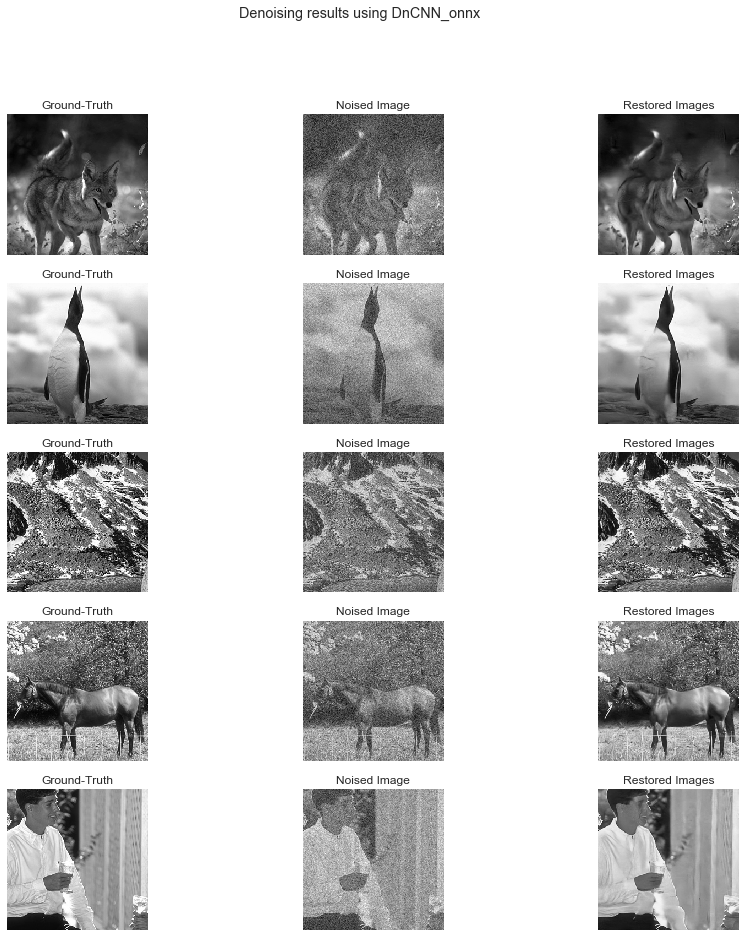

Onnx Model tutorial
===================

This tutorial is a part of Model module guide. Here, we explore how you
can use the OnnxModel wrapper to use your Onnx deep learning models in
the benchmark.

.. code:: ipython3

    import gc
    import keras
    import onnx
    import torch
    import tf2onnx
    import keras2onnx
    import numpy as np
    import matlab.engine
    import tensorflow as tf
    import matplotlib.pyplot as plt

    from functools import partial
    from OpenDenoising import data
    from OpenDenoising import model
    from OpenDenoising import evaluation

    eng = matlab.engine.start_matlab()

The following function will be used throughout this tutorial to display denoising results,

.. code-block:: python

    def display_results(clean_imgs, noisy_imgs, rest_images, name):
        """Display denoising results."""
        fig, axes = plt.subplots(5, 3, figsize=(15, 15))

        plt.suptitle("Denoising results using {}".format(name))

        for i in range(5):
            axes[i, 0].imshow(np.squeeze(clean_imgs[i]), cmap="gray")
            axes[i, 0].axis("off")
            axes[i, 0].set_title("Ground-Truth")

            axes[i, 1].imshow(np.squeeze(noisy_imgs[i]), cmap="gray")
            axes[i, 1].axis("off")
            axes[i, 1].set_title("Noised Image")

            axes[i, 2].imshow(np.squeeze(rest_imgs[i]), cmap="gray")
            axes[i, 2].axis("off")
            axes[i, 2].set_title("Restored Images")

Moreover, you may download the data we will use by using the following function,

.. code-block:: python

    data.download_BSDS_grayscale(output_dir="./tmp/BSDS500/")

The models will be evaluated using the BSDS dataset,

.. code-block:: python

    # Validation images generator
    valid_generator = data.DatasetFactory.create(path="./tmp/BSDS500/Valid",
                                                 batch_size=8,
                                                 n_channels=1,
                                                 noise_config={data.utils.gaussian_noise: [25]},
                                                 name="BSDS_Valid")

Onnx Model
----------

This notebook covers how OnnxModel class can be used to hold Deep
Learning models, and to perform inference. We remark that Onnx is a
framework focused on deploying trained neural networks, hence, there is
no support for training models in this format.

Charging a model
----------------

The charging can only be done by the specification of a “.onnx” file,
which holds the model’s computational graph as well as weights. To
perform inference, we rely on `onnxruntime
module <https://github.com/microsoft/onnxruntime>`__ for Python.

After charging a model into OnnxModel, a onnxruntime session is created
so that you can perform inference.

.. code:: ipython3

    onnx_model_ex1 = model.OnnxModel(model_name="DnCNN_onnx")
    onnx_model_ex1.charge_model(model_path="./Additional Files/Onnx Models/dncnn.onnx")

Running Inference
-----------------

Inference can be done by using the “\__call_\_” method required by the
AbstractDeepLearningModel interface. This method ensures that derived
classes (as OnnxModel) can be used a function. Bellow, a batch of
noisy/clean images is drawn from the dataset, and the OnnxModel used to
predict the restored image,

.. code:: ipython3

    # Get batch from valid_generator
    noisy_imgs, clean_imgs = next(valid_generator)
    # Performs inference on noisy images
    rest_imgs = onnx_model_ex1(noisy_imgs)
    # Display results
    display_results(clean_imgs, noisy_imgs, rest_imgs, str(onnx_model_ex1))

Converting models to Onnx
-------------------------

`Onnx <https://onnx.ai/>`__ is thought as a bridge between different
Deep Learning frameworks. It is used to deploy models for inference
(assuming they were trained previously).

Each language has its own way of converting its models into Onnx. Some
of them, such as `Pytorch <https://pytorch.org/docs/stable/onnx.html>`__
and
`Matlab <https://fr.mathworks.com/help/deeplearning/ref/importonnxnetwork.html>`__,
have such support natively. Others, rely on non-official modules such as
`keras2onnx <https://github.com/onnx/keras-onnx>`__ or
`tf2onnx <https://github.com/onnx/tensorflow-onnx>`__.

Keras to Onnx
-------------

.. code:: ipython3

    # Loads Keras model
    keras_model = keras.models.load_model("./Additional Files/Keras Models/dncnn.hdf5")
    # Converts Keras model to Onnx
    onnx_model = keras2onnx.convert_keras(keras_model, "myModel")
    # Saves Onnx model
    onnx.save(onnx_model, "./Additional Files/Onnx Models/dncnn_from_keras.onnx")

Pytorch to Onnx
---------------

.. code:: ipython3

    # Loads torch model
    torch_model = torch.load("./Additional Files/Pytorch Models/dncnn.pth")
    dummy = torch.randn(5, 1, 40, 40, device="cuda")
    torch_model = torch_model.cuda()
    torch.onnx.export(torch_model, dummy, "./Additional Files/Onnx Models/dncnn_from_pytorch.onnx",
                      input_names=["input"], output_names=["output"])

.. code:: ipython3

    # Loads onnx file from Pytorch
    onnx_model = onnx.load("./Additional Files/Onnx Models/dncnn_from_pytorch.onnx")
    print("[Graph Input] name: {}, shape: {}".format(onnx_model.graph.input[0].name,
                                                     [dim.dim_value for dim in onnx_model.graph.input[0].type.tensor_type.shape.dim]))
    print("[Graph Output] name: {}, shape: {}".format(onnx_model.graph.output[0].name,
                                                      [dim.dim_value for dim in onnx_model.graph.output[0].type.tensor_type.shape.dim]))

.. parsed-literal::

    [Graph Input] name: input, shape: [5, 1, 40, 40]
    [Graph Output] name: output, shape: [5, 1, 40, 40]

Notice that the past two tensors are of fixed size (both batch size,
height and width). We address this problem in the next section.

Note on Pytorch2Onnx
^^^^^^^^^^^^^^^^^^^^

Since Pytorch does not support `dynamic
shapes <https://github.com/onnx/onnx/issues/654>`__ (i.e. None values in
shape), the exported Onnx model will have fixed shape, which can be
problematic at inference (you can only process images by slicing them
into fixed-sized patches).

However, there is a turn-around for such problem, that is to process
Onnx graph and switch the height/width values for “?” values (analogous
to None in Tensorflow/Keras).

If you face problems with fixed-sized inputs, you can use the
model.utils module for conversion:

.. code:: ipython3

    model.utils.onnx_dynamic_shapes("./Additional Files/Onnx Models/dncnn_from_pytorch.onnx",
                                    "./Additional Files/Onnx Models/dncnn_from_pytorch_dyn_shapes.onnx",
                                    channels_first=True)

.. code:: ipython3

    # Loads onnx file from Pytorch
    onnx_model_dyn_shapes = onnx.load("./Additional Files/Onnx Models/dncnn_from_pytorch_dyn_shapes.onnx")
    print("New graph:")
    print("[Graph Input]\n {}".format(onnx_model_dyn_shapes.graph.input[0]))
    print("[Graph Output] name: {}".format(onnx_model_dyn_shapes.graph.output[0]))

.. parsed-literal::

    New graph:
    [Graph Input]
     name: "input"
    type {
      tensor_type {
        elem_type: 1
        shape {
          dim {
            dim_param: "?"
          }
          dim {
            dim_value: 1
          }
          dim {
            dim_param: "?"
          }
          dim {
            dim_param: "?"
          }
        }
      }
    }

    [Graph Output] name: name: "output"
    type {
      tensor_type {
        elem_type: 1
        shape {
          dim {
            dim_param: "?"
          }
          dim {
            dim_value: 1
          }
          dim {
            dim_param: "?"
          }
          dim {
            dim_param: "?"
          }
        }
      }
    }

Tensorflow to Onnx
~~~~~~~~~~~~~~~~~~~

In order to convert a Tensorflow model to Onnx, you need to convert all
its variables to constants. To do so, the **model.utils** module has a
function called **freeze_tf_graph** that converts all the variables in
the **current** Tensorflow graph to constants.

You can either specify a model_file (containing your Tensorflow Model)
to be read and frozen, or let the function get the default graph and
session. In the first case, the default graph is expected to be empty
(that is, you have not previously defined any tensorflow computation).

In this example, we will freeze the Tensorflow model present on
“./Additional Files/Tensorflow Models/from_saved_model”.

.. code:: ipython3

    # Note that, in the previous sections, we have loaded a graph using Keras.
    # With tf.reset_default_graph, we can reset Tensorflow's computational graph.
    tf.reset_default_graph()

.. code:: ipython3

    model.utils.freeze_tf_graph(model_file="./Additional Files/Tensorflow Models/from_saved_model/saved_model.pb",
                                output_filepath="./Additional Files/Tensorflow Models/frozen_model.pb",
                                output_node_names=["output"])

.. code:: ipython3

    # Note that, in the previous function, we have loaded the graph in saved_model.
    # With tf.reset_default_graph, we can reset Tensorflow's computational graph.
    tf.reset_default_graph()

.. code:: ipython3

    model.utils.pb2onnx(path_to_pb="./Additional Files/Tensorflow Models/frozen_model.pb",
                        path_to_onnx="./Additional Files/Onnx Models/dncnn_from_tf.onnx",
                        input_node_names=["input"], output_node_names=["output"])

Matlab to Onnx
--------------

Once you have trained your model using `Matlab’s Deep Learning
Toolbox <https://www.mathworks.com/products/deep-learning.html>`__, you
should either a network object on your workspace, or a .mat file saved
on a folder.

Taking the last case as example, we consider the file “./Additional
Files/Matlab Models/dncnn_matlab.mat” previously trained. In order to
convert it to Onnx, you can either do it from Python (by using matlab’s
engine) or directly on Matlab. Keep in mind that every command run with
engine.evalc is a pure matlab command.

.. code:: ipython3

    eng.evalc("load('./Additional Files/Matlab Models/dncnn_matlab.mat');")

.. parsed-literal::

  Matlab's Workspace:

  Name      Size              Bytes  Class            Attributes

  ME        1x1                1091  MException
  net       1x1             2258128  SeriesNetwork

.. code:: ipython3

    eng.evalc("exportONNXNetwork(net, './Additional Files/Onnx Models/dncnn_from_matlab_tb.onnx')")

