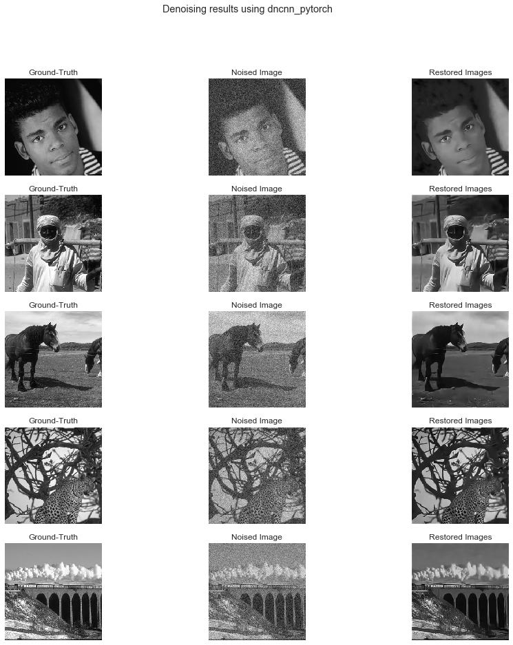

Pytorch Model tutorial
======================

This tutorial is a part of Model module guide. Here, we explore how you
can use the Pytorch wrapper to use your Pytorch deep learning models in
the benchmark.

.. code:: ipython3

    # Python packages
    import gc
    import torch
    import numpy as np
    import matplotlib.pyplot as plt

    from functools import partial
    from OpenDenoising import data
    from OpenDenoising import model
    from OpenDenoising import evaluation

The following function will be used throughout this tutorial to display denoising results,

.. code-block:: python

    def display_results(clean_imgs, noisy_imgs, rest_images, name):
        """Display denoising results."""
        fig, axes = plt.subplots(5, 3, figsize=(15, 15))

        plt.suptitle("Denoising results using {}".format(name))

        for i in range(5):
            axes[i, 0].imshow(np.squeeze(clean_imgs[i]), cmap="gray")
            axes[i, 0].axis("off")
            axes[i, 0].set_title("Ground-Truth")

            axes[i, 1].imshow(np.squeeze(noisy_imgs[i]), cmap="gray")
            axes[i, 1].axis("off")
            axes[i, 1].set_title("Noised Image")

            axes[i, 2].imshow(np.squeeze(rest_imgs[i]), cmap="gray")
            axes[i, 2].axis("off")
            axes[i, 2].set_title("Restored Images")

Moreover, you may download the data we will use by using the following function,

.. code-block:: python

    data.download_BSDS_grayscale(output_dir="./tmp/BSDS500/")

The models will be evaluated using the BSDS dataset,

.. code-block::

    # Training images generator
    train_generator = data.DatasetFactory.create(path="./tmp/BSDS500/Train",
                                                 batch_size=8,
                                                 n_channels=1,
                                                 noise_config={data.utils.gaussian_noise: [25]},
                                                 preprocessing=[partial(data.gen_patches, patch_size=40),
                                                                partial(data.dncnn_augmentation, aug_times=1)],
                                                 name="BSDS_Train")

.. code-block:: python

    # Validation images generator
    valid_generator = data.DatasetFactory.create(path="./tmp/BSDS500/Valid",
                                                 batch_size=8,
                                                 n_channels=1,
                                                 noise_config={data.utils.gaussian_noise: [25]},
                                                 name="BSDS_Valid")

Charging a model
----------------

To charge a model, you can either specify the path to a “.pth” or “.ph”
file using “**model_path**” argument, or an instance of a class
inheriting from
`torch.nn.Module <https://pytorch.org/docs/stable/nn.html>`__ class
using “**model_function**” argument.

The “.ph”/“.pth” files need to be saved from the entire model, that is,
an instance of a class which inherits from torch.nn.Module (for more
information, look at `Pytorch
documentation <https://pytorch.org/tutorials/beginner/saving_loading_models.html>`__).

For the “**model_function**” argument, you need to specify a Pytorch
model class, which inherits from torch.nn.Module.

Charging from a Class
---------------------

Consider the following implementation of DnCNN on Pytorch (code based on
`this Github page <https://github.com/SaoYan/DnCNN-PyTorch>`__),

.. code:: python

   class DnCNN(nn.Module):
       def __init__(self, depth=17, n_filters=64, kernel_size=3, n_channels=1):
           super(DnCNN, self).__init__()
           layers = [
               nn.Conv2d(in_channels=n_channels, out_channels=n_filters, kernel_size=kernel_size,
                         padding=1, bias=False),
               nn.ReLU(inplace=True)
           ]
           for _ in range(depth-2):
               layers.append(nn.Conv2d(in_channels=n_filters, out_channels=n_filters, kernel_size=kernel_size,
                                       padding=1, bias=False))
               layers.append(nn.BatchNorm2d(n_filters))
               layers.append(nn.ReLU(inplace=True))
           layers.append(nn.Conv2d(in_channels=n_filters, out_channels=n_channels, kernel_size=kernel_size,
                                   padding=1, bias=False))
           self.dncnn = nn.Sequential(*layers)

       def forward(self, x):
           out = self.dncnn(x)
           return out

You can charge your model by passing it to the “**model_function**”
argument. If you need to pass any optional arguments to the class init
function, you can do so by using kwargs,

.. code:: ipython3

    torch_ex1 = model.PytorchModel(model_name="dncnn_pytorch", logdir="../../training_logs/Pytorch")
    torch_ex1.charge_model(model_function=model.architectures.pytorch.DnCNN, depth=17)

Charging from a file
--------------------

To charge a model from a file, you need to save it with extension “.pt”
or “.pth”. Important to mention, you need to save your whole model, and
not only its state dict.

.. code:: ipython3

    torch_ex2 = model.PytorchModel(model_name="dncnn_pytorch", logdir="../../training_logs/Pytorch")
    torch_ex2.charge_model(model_path="./Additional Files/Pytorch Models/dncnn.pth", depth=17)

Running inference
-----------------

Since PytorchModel implements “**call**” function, inference can be done
by simply using the instance as a function. Moreover, it is important to
remark that Pytorch models only accept **NCHW** (batch size - channel -
height - width) data format. To overcome this issue, the “**call**”
function automatically handles conversion between **NCHW** and **NHWC**.
In all cases, you should expect the shape of inputs to be equal to the
output shape.

.. code:: ipython3

    # Get batch from valid_generator
    noisy_imgs, clean_imgs = next(valid_generator)
    # Performs inference on noisy images
    rest_imgs = torch_ex2(noisy_imgs)
    # Display results
    display_results(clean_imgs, noisy_imgs, rest_imgs, str(torch_ex2))

Training a Pytorch Model
------------------------

To train a Pytorch model, you need to specify at least one dataset (for
training, as evaluation is optional). The rest of the parameters is
discussed bellow,

**n_epochs (int)**

Number of training epochs.

**n_stages (int)**

Number of batches drawn from the dataset at each epoch. The total number
of iterations corresponds to

.. math:: n_{iterations} = n_{epochs} \times n_{stages}

**optimizer_name (str)**

Name of the optimizer’s class (Take a look on `Pytorch’s
documentation <https://pytorch.org/docs/stable/optim.html>`__).

**metrics (list)**

List of metric functions. These functions should have two inputs, two
instances of ‘numpy.ndarray’ class. It outputs a float corresponding to
the metric computed on those two arrays. For more information, take a
look on the Benchmarking module.

**kcallbacks (list)**

List of callbacks. Take a look on the evaluation documentation.

**loss (torch.nn.modules.loss)**

Pytorch `loss
function <https://pytorch.org/docs/stable/nn.html#loss-functions>`__.

**valid_steps (int)**

Number of validation batches drawn at the end of each epoch.

.. code:: ipython3

    torch_ex3 = model.PytorchModel(model_name="dncnn_pytorch", logdir="../../training_logs/Pytorch")
    torch_ex3.charge_model(model_function=model.architectures.pytorch.DnCNN, depth=17)
    torch_ex3.train(train_generator=train_generator,
                    valid_generator=valid_generator,
                    n_epochs=100,
                    n_stages=465,
                    learning_rate=1e-3,
                    optimizer_name="Adam",
                    metrics=[evaluation.psnr,
                             evaluation.ssim,
                             evaluation.mse],
                    kcallbacks=[evaluation.DnCNNSchedule(),
                                evaluation.CheckpointCallback(torch_ex3, monitor="val_PSNR"),
                                evaluation.TensorboardImage(valid_generator, torch_ex3)],
                    loss=torch.nn.MSELoss(reduction="sum"),
                    valid_steps=10)