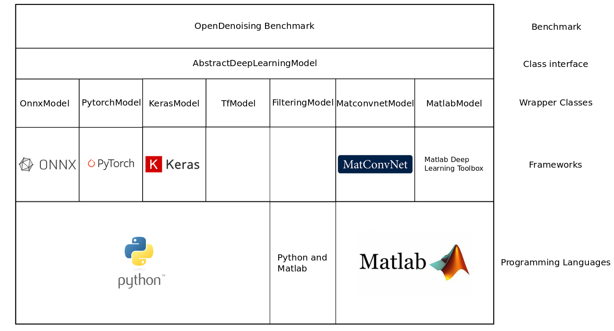

# Open Denoising: An Open Benchmark for Image Denoising Methods

This repository contains the code developped by Eduardo Montesuma, under the advisorship of Florian Lemarchand and Maxime Pelcat at IETR.

# Contributors 
- Eduardo Fernandes-Montesuma eduardo.fernandes-montesuma@insa-rennes.fr (2019)
- Florian Lemarchand florian.lemarchand@insa-rennes.fr (2019)
- Maxime Pelcat maxime.pelcat@insa-rennes.fr (2019)

# Repository organization

* __Documentation__ contains the code documentation, hosted at [Read The Docs](https://opendenoising-docs.readthedocs.io/en/latest/) website.
* __OpenDenoising__ contains the code for the OpenDenoising benchmark. It is divided into four modules,
    * __data__ It contains an interface for dataset generator classes that will feed data into the denoiser models.
    * __model__ It contains various interfaces defining the behaviour of Deep Learning denoising models, and Filtering models.
                It has also a series of Wrapper Classes, designed to implement these interfaces using each Framework.
    * __benchmarking__ It contains the functions responsable for evaluation and visualization of model's performance.
    * __custom_callbacks__ It contains the functions responsable for tracking the training of Deep Learning models.

Here is an overview of the layers of abstraction in our Benchmark:

# Class diagram

For a better visualisation of how the Benchmark classes are organized, we provide an UML Class diagram:

# Built-in models

__Filtering models__
* BM3D1 [[Matlab Code]](ttp://www.cs.tut.fi/~foi/GCF-BM3D/). By using BM3D you are agreeing with its [license terms](http://www.cs.tut.fi/~foi/GCF-BM3D/legal_notice.html)

__Deep Learning models__]
* DnCNN2 [[Matlab Code]](https://github.com/cszn/DnCNN/) [[Keras Code]](https://github.com/cszn/DnCNN/tree/master/TrainingCodes/dncnn_keras) [[Tensorflow Code]](https://github.com/wbhu/DnCNN-tensorflow) [Pytorch Code](https://github.com/SaoYan/DnCNN-PyTorch)
* xDnCNN3 [[Pytorch Code]](https://github.com/kligvasser/xUnit)
* REDNet4
* MWCNN5, 6 [[Matlab Code]](https://github.com/lpj0/MWCNN) [[Pytorch Code]](https://github.com/lpj0/MWCNN_PyTorch)

# References

1. Dabov K, Foi A, Katkovnik V, Egiazarian K. Image denoising by sparse 3-D transform-domain collaborative
   filtering. IEEE Transactions on image processing. 2007
2. Zhang K, Zuo W, Chen Y, Meng D, Zhang L. Beyond a gaussian denoiser: Residual learning of deep cnn for image
   denoising. IEEE Transactions on Image Processing. 2017 
3. Kligvasser I, Rott Shaham T, Michaeli T. xUnit: Learning a spatial activation function for efficient image
   restoration. InProceedings of the IEEE Conference on Computer Vision and Pattern Recognition 2018
4. Mao XJ, Shen C, Yang YB. Image restoration using convolutional auto-encoders with symmetric skip connections.
   arXiv preprint arXiv:1606.08921. 2016
5. Liu P, Zhang H, Lian W, Zuo W. Multi-Level Wavelet Convolutional Neural Networks. IEEE Access. 2019
6. Liu P, Zhang H, Zhang K, Lin L, Zuo W. Multi-level wavelet-CNN for image restoration. InProceedings of the IEEE
   Conference on Computer Vision and Pattern Recognition Workshops 2018

# Contributing

If you want to contribute or make a suggestion to this Benchmark, you can either do so by [contacting us](#Contributors),
or by using git pull requests/issues tools.
