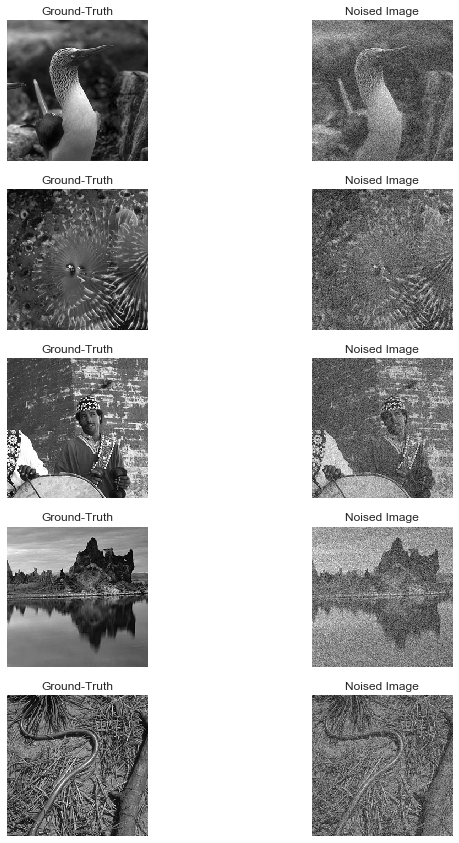
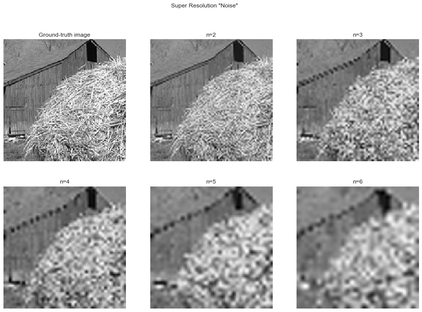

Example: creating datasets
==========================

Here we present a tutorial on how you can use the OpenDenoising data module to provide data to your denoising algorithms.
You should follow the snippets on this tutorial sequentially.

First, being on the project's root, you need to import the necessary modules,

.. code:: python

    import cv2
    import numpy as np
    import matplotlib.pyplot as plt

    from functools import partial
    from OpenDenoising import data
    from skimage.measure import compare_psnr

For now on, we suppose you are running your codes on the project root folder.

CleanDatasetGenerator Class
---------------------------

Many Deep Learning models for image restoration are trained using **artificial types of noise**. In such setting, one
have a dataset of clean images, that is, images without any kind of noise or degradation process. To train the network,
these images are noised using artificial noise models, such as **gaussian noise** or **salt and pepper noise**.

We call these datasets containing only **ground-truth images** a "clean dataset", and they are handled by the class
CleanDatasetGenerator. For mode details on how you can artificially add noise to images, look at the
*Artificial Noising* section.

During this section, we will base our analysis on the dataset used to train `DnCNN
<https://arxiv.org/pdf/1608.03981.pdf>`_ network. The dataset used is called Berkeley Segmentation Dataset (BSDS),
consisting of 500 images. For training, BSDS consider 400 cropped images, and further uses 68 images not present on
training data for validation/testing.

Additionally, each dataset type has a specific folder structure. We suppose that your Clean Datasets have the following
structure:

.. parsed-literal::

    DatasetName/
    |-- Train
    |   |-- ref
    |-- Valid
    |   |-- ref

Downloading BSDS Dataset
^^^^^^^^^^^^^^^^^^^^^^^^

The benchmark include a tool for automatically download the `training <https://github.com/aGIToz/KerasDnCNN/tree/master/genData>`_
and `validation <https://github.com/cszn/DnCNN/blob/master/testsets/BSD68>`_ datasets from Github pages.
These datasets may be further be saved to a "./tmp" folder, as follows:

.. code:: python

    data.download_BSDS_grayscale(output_dir="./tmp/BSDS500/")

Creating a CleanDatasetGenerator
^^^^^^^^^^^^^^^^^^^^^^^^^^^^^^^^

To create a Clean Dataset, you can use the DatasetFactory class by specifying the following parameters:

* **batch_size**: Following `DnCNN's paper <https://arxiv.org/pdf/1608.03981.pdf>`_, the number of patches per batch is 128.
  However, the batch_size corresponds to the number of images into each batch. Considering a patch size of 40, we end up
  with 16 times more patches than images. Hence, to end up with 128 patches per batch, we need 8 images per batch.
* **n_channels**: as our images are grayscale, n_channels = 1
* **preprocessing**: Following `DnCNN's paper <https://arxiv.org/pdf/1608.03981.pdf>`_, we need to extract :math:`40 \times 40`
  patches from the images we just downloaded. We can do this by using the function "data.gen_patches".
* **name**: we will specify "BSDS_Train" as the dataset's name.
* **noise_config**: Here we can configure the artificial noise that will be added to each image sample :math:`\mathbf{x}`.
  For our first example, we will add gaussian noise with intensity $\sigma=25$ (always specified with respect to 0-255 range).

These specifications are specified by the following snippet,

.. code:: python

    batch_size = 8
    n_channels = 1
    patch_size = 40
    channels_first = False
    noise_config = {data.utils.gaussian_noise: [25]}
    preprocessing = [partial(data.gen_patches, patch_size=patch_size, channels_first=channels_first)]

With these configurations, you can create your train and valid generators,

.. code:: python

    train_generator = data.DatasetFactory.create(path="./tmp/BSDS500/Train",
                                                 batch_size=batch_size,
                                                 n_channels=1,
                                                 noise_config=noise_config,
                                                 preprocessing=preprocessing,
                                                 name="BSDS_Train")

    valid_generator = data.DatasetFactory.create(path="./tmp/BSDS500/Valid",
                                                 batch_size=batch_size,
                                                 n_channels=1,
                                                 noise_config=noise_config,
                                                 name="BSDS_Valid")

Notice that we need to specify the path to the root folder, and not to "ref". The "ref" folder, in that case, is the only
folder containing images (as we generate noisy images at execution time). Using these two instances of our class, we may
generate images that will be fed to Deep Learning models for training and inference,

The instances of DatasetGenerator class behave as if they were lists. Being so, you can loop through its contents by
using list comprehension. For instance,

.. code:: python

    for Xbatch, Ybatch in train_generator:
        # Do something

will read the images on "./tmp" and output "Xbatch" (noisy images) and "Ybatch" (clean images). You may also use the
Python built-in function *next*, which reads data sequentially. Moreover, to see the images generated by the generator
you may run the following snippet,

.. code:: python

    Xbatch, Ybatch = next(train_generator)
    fig, axes = plt.subplots(5, 2, figsize=(10, 15))

    for i in range(5):
        axes[i, 0].imshow(np.squeeze(Xbatch[i]), cmap="gray")
        axes[i, 0].axis("off")
        axes[i, 0].set_title("Ground-Truth")

        axes[i, 1].imshow(np.squeeze(Ybatch[i]), cmap="gray")
        axes[i, 1].axis("off")
        axes[i, 1].set_title("Noised Patch")

.. image:: Figures/DataTutorialOut1.png
    :alt: BSDS patches outputted by train_generator.

To see the images in valid_generator, a similar snippet can be run,

.. code:: python

    Xbatch, Ybatch = next(valid_generator)
    fig, axes = plt.subplots(5, 2, figsize=(10, 15))

    for i in range(5):
        axes[i, 0].imshow(np.squeeze(Xbatch[i]), cmap="gray")
        axes[i, 0].axis("off")
        axes[i, 0].set_title("Ground-Truth")

        axes[i, 1].imshow(np.squeeze(Ybatch[i]), cmap="gray")
        axes[i, 1].axis("off")
        axes[i, 1].set_title("Noised Patch")

Artificial Noising
^^^^^^^^^^^^^^^^^^
In this section we provide the details for adding artificial noise into clean images. First, we cover the basic corruption
functions in the :py:mod:`OpenDenoising.data` module,

**Gaussian Noise**

For additive noises, such as the Gaussian Noise, the noised images :math:`\mathbf{y}` obeys the following expression,

.. math::

    \mathbf{y} = \mathbf{x} + \mathbf{\epsilon},

where :math:`\mathbf{x}` the ground-truth and :math:`\mathbf{\epsilon}` the noise component. For the Gaussian Noise model,
:math:`\mathbf{\epsilon} \sim \mathcal{N}(0, \sigma^{2})`, that is, is an Additive White Gaussian Noise (it is additive,
and has zero mean).

The main parameter controlling the level of Gaussian Noise is the variance :math:`\sigma`. Considering its specification,
it is noteworthy that the value of :math:`\sigma`, and consequently the impact of such noise on the outcome :math:`\mathbf{y}`
is dependent on the range of the original image :math:`\mathbf{x}`. As a convention, we remark that $\sigma$ should be
specified with respect to the uint8 range, that is, [0, 255].

The following snippet shows an example of images contaminated with gaussian noise,

.. code:: python

    x = cv2.imread('./tmp/BSDS500/Train/ref/test_400.png', 0) # Reads a grayscale image
    x = x.astype('float32') / 255 # uint8 => float32

    y_1 = data.utils.gaussian_noise(x, noise_level=10)
    y_2 = data.utils.gaussian_noise(x, noise_level=15)
    y_3 = data.utils.gaussian_noise(x, noise_level=25)
    y_4 = data.utils.gaussian_noise(x, noise_level=40)
    y_5 = data.utils.gaussian_noise(x, noise_level=50)

    fig, axes = plt.subplots(2, 3, figsize=(15, 10))

    plt.suptitle('Gaussian Noise')

    axes[0, 0].imshow(x, cmap='gray')
    axes[0, 0].axis('off')
    axes[0, 0].set_title('Ground-truth image')

    axes[0, 1].imshow(y_1, cmap='gray')
    axes[0, 1].axis('off')
    axes[0, 1].set_title(r'$\sigma$=10')

    axes[0, 2].imshow(y_2, cmap='gray')
    axes[0, 2].axis('off')
    axes[0, 2].set_title(r'$\sigma$=15')

    axes[1, 0].imshow(y_3, cmap='gray')
    axes[1, 0].axis('off')
    axes[1, 0].set_title(r'$\sigma$=25')

    axes[1, 1].imshow(y_4, cmap='gray')
    axes[1, 1].axis('off')
    axes[1, 1].set_title(r'$\sigma$=40')

    axes[1, 2].imshow(y_5, cmap='gray')
    axes[1, 2].axis('off')
    axes[1, 2].set_title(r'$\sigma$=50')

.. image:: Figures/DataTutorialOut3.png
    :alt: Summary of Gaussian Noise.

**Remark:** a similar kind of noise is specified by :py:mod:`data.utils.gaussian_blind_noise`, which is used, for instance,
to train the DnCNN network for Blind denoising (noised images only). In that case, the :math:`\sigma` parameter is drawn
uniformly from the range \[:math:`\sigma_{min}`, :math:`\sigma_{max}`\]. The function, hence, accepts two parameters,
one for the minimum value of :math:`\sigma`, and other, for its maximum value.

**Salt and Pepper Noise**

The salt and pepper noise, also called the shot noise, has a probability :math:`p` of disturbing a given pixel. Once a
pixel is perturbed, it has equal probability of being saturated to either 1, or 0.

To specify the salt and pepper noise, you need to specify its probability of disturbing a pixel.

.. code:: python

    y_1 = data.utils.salt_and_pepper_noise(x, noise_level=10)
    y_2 = data.utils.salt_and_pepper_noise(x, noise_level=15)
    y_3 = data.utils.salt_and_pepper_noise(x, noise_level=25)
    y_4 = data.utils.salt_and_pepper_noise(x, noise_level=40)
    y_5 = data.utils.salt_and_pepper_noise(x, noise_level=50)

    fig, axes = plt.subplots(2, 3, figsize=(15, 10))

    plt.suptitle('Salt and Pepper Noise')

    axes[0, 0].imshow(x, cmap='gray')
    axes[0, 0].axis('off')
    axes[0, 0].set_title('Ground-truth image')

    axes[0, 1].imshow(y_1, cmap='gray')
    axes[0, 1].axis('off')
    axes[0, 1].set_title(r'$p$=10%')

    axes[0, 2].imshow(y_2, cmap='gray')
    axes[0, 2].axis('off')
    axes[0, 2].set_title(r'$p$=15%')

    axes[1, 0].imshow(y_3, cmap='gray')
    axes[1, 0].axis('off')
    axes[1, 0].set_title(r'$p$=25%')

    axes[1, 1].imshow(y_4, cmap='gray')
    axes[1, 1].axis('off')
    axes[1, 1].set_title(r'$p$=40%')

    axes[1, 2].imshow(y_5, cmap='gray')
    axes[1, 2].axis('off')
    axes[1, 2].set_title(r'$p$=50%')

.. image:: Figures/DataTutorialOut4.png
    :alt: Summary of Salt and Pepper Noise.

**Image Restoration degradations**

Image Restoration is a broader topic than image denoising, comprehending corruption models that follow a more general
expression:

.. math::

    \mathbf{y} = \mathbf{H}(\mathbf{x}) + \mathbf{\epsilon},

where :math:`\mathbf{H}`$` is called the *degradation operator*. It is clear that when :math:`\mathbf{H}` is the identity,
the denoising problem is restored. Due to their similarity, neural networks may be trained to solve both kinds of problems.
Moreover, since the State-of-the-Art is commonly evaluated for both denoising and restoration problems, we have included
two of the most common degradation processes: Super Resolution and JPEG Deblocking.

We encourage you to use the terms denoising and restoration, as well as noise and degradation interchangeably throughout
the dataset.

**Super Resolution Noise**

Super-Resolution is a sub-problem of Image Restoration where we want to resize an image :math:`(h, w)` to
:math:`(n\times h, n\times w)` while minimizing the quality loss. To train a Deep Neural network to perform such task is
equivalent to train a model to restore an image that was deteriorated while performing the resize operation.

To generate images with resolution artifcats, we perform two steps:

1. Take an image of size :math:`[h, w]`. Downsample it using bicubic interpolation to :math:`[h / n, w / n]`.
2. Upsample it using bicubic interpolation back to :math:`[h, w]`.

The resulting image will exhibit low-resolution artifacts, which can be treated as any other kind of artificial noise.
The introduction of resolution artifacts in image is done through the function :py:func:`data.utils.super_resolution_noise`,
and the level of degradetaion is controlled through the parameter *noise_level*, which corresponds to the n,
described in the two steps above.

.. code:: python

    y_1 = data.utils.super_resolution_noise(x, noise_level=2)
    y_2 = data.utils.super_resolution_noise(x, noise_level=3)
    y_3 = data.utils.super_resolution_noise(x, noise_level=4)
    y_4 = data.utils.super_resolution_noise(x, noise_level=5)
    y_5 = data.utils.super_resolution_noise(x, noise_level=6)

    fig, axes = plt.subplots(2, 3, figsize=(15, 10))

    plt.suptitle('Super Resolution "Noise"')

    axes[0, 0].imshow(x, cmap='gray')
    axes[0, 0].axis('off')
    axes[0, 0].set_title('Ground-truth image')

    axes[0, 1].imshow(y_1, cmap='gray')
    axes[0, 1].axis('off')
    axes[0, 1].set_title(r'n=2')

    axes[0, 2].imshow(y_2, cmap='gray')
    axes[0, 2].axis('off')
    axes[0, 2].set_title(r'n=3')

    axes[1, 0].imshow(y_3, cmap='gray')
    axes[1, 0].axis('off')
    axes[1, 0].set_title(r'n=4')

    axes[1, 1].imshow(y_4, cmap='gray')
    axes[1, 1].axis('off')
    axes[1, 1].set_title(r'n=5')

    axes[1, 2].imshow(y_5, cmap='gray')
    axes[1, 2].axis('off')
    axes[1, 2].set_title(r'n=6')

**JPEG Artifacts**

As super resolution, JPEG deblocking is another kind of image restoration task, where we want to restore an image that
was degraded by compressing it using JPEG algorithm. The introduction of JPEG artifcats in the image is done by using
:py:func:`data.utils.jpeg_artifacts`.  It has one parameter, controlling the intensity of compression, which is
*compression_rate* (given as a percentage of information lost).

.. code:: python

    y_1 = data.utils.super_resolution_noise(x, noise_level=10)
    y_2 = data.utils.super_resolution_noise(x, noise_level=20)
    y_3 = data.utils.super_resolution_noise(x, noise_level=50)
    y_4 = data.utils.super_resolution_noise(x, noise_level=75)
    y_5 = data.utils.super_resolution_noise(x, noise_level=90)

    fig, axes = plt.subplots(2, 3, figsize=(15, 10))

    plt.suptitle('JPEG "Noise"')

    axes[0, 0].imshow(x, cmap='gray')
    axes[0, 0].axis('off')
    axes[0, 0].set_title('Ground-truth image')

    axes[0, 1].imshow(y_1, cmap='gray')
    axes[0, 1].axis('off')
    axes[0, 1].set_title(r'compression_rate=10')

    axes[0, 2].imshow(y_2, cmap='gray')
    axes[0, 2].axis('off')
    axes[0, 2].set_title(r'compression_rate=20')

    axes[1, 0].imshow(y_3, cmap='gray')
    axes[1, 0].axis('off')
    axes[1, 0].set_title(r'compression_rate=50')

    axes[1, 1].imshow(y_4, cmap='gray')
    axes[1, 1].axis('off')
    axes[1, 1].set_title(r'compression_rate=75')

    axes[1, 2].imshow(y_5, cmap='gray')
    axes[1, 2].axis('off')
    axes[1, 2].set_title(r'compression_rate=90')

**Extending Noise Types**

In the CleanDatasetGenerator, noise is artificially added to images at each time an image is read from memory.
**You should keep in mind that, if your noising function introduces too much overhead into the batch generation process,
you should avoid specifying it**. Instead, if that is the case, you can add noise to the images, then save the noised ones
on $(\$DATASETPATH)/in/$ and use them as if they were a "FullDataset" (see bellow).

Each CleanDatasetGenerator has an internal dictionary of noising functions. This dictionary consists of pairs
"function: args", where function is the noising function that will corupt the data, and args are the arguments for it.
You can specify more than one noise, knowing that they will be applied sequentially, as can be seen bellow,

.. code:: python

    noise_config = {
        data.utils.gaussian_blind_noise: [0, 55],
        data.utils.salt_and_pepper_noise: [10]
    }

    valid_generator = data.DatasetFactory.create(path="./tmp/BSDS500/Valid",
                                                 batch_size=8,
                                                 n_channels=1,
                                                 noise_config=noise_config,
                                                 name="BSDS_Valid")

    Ybatch, Xbatch = next(valid_generator)
    fig, axes = plt.subplots(5, 2, figsize=(10, 15))

    for i in range(5):
        axes[i, 0].imshow(np.squeeze(Xbatch[i]), cmap="gray")
        axes[i, 0].axis("off")
        axes[i, 0].set_title("Ground-Truth")

        axes[i, 1].imshow(np.squeeze(np.clip(Ybatch[i], 0, 1)), cmap="gray")
        axes[i, 1].axis("off")
        axes[i, 1].set_title("Noised Image")

.. image:: Figures/DataTutorialOut7.png
    :alt: Summary of Composed noises.

FullDatasetGenerator Class
--------------------------

Some other datasets happen to have matched image pairs :math:`\mathbf{x}_{i}, \mathbf{y}_{i}`. In that case, instead of
generating an artificial noise to train the dataset, we may use the pairs for training Deep Learning Model, as well as
to assess model quality. Full Datasets need to have the following folder structure,

.. parsed-literal::

    DatasetName/
    |-- Train
    |   |-- in
    |   |-- ref
    |-- Valid
    |   |-- in
    |   |-- ref

Here we use as example the PolyU real-world denoising dataset. You can either download it from their
`Github page <https://github.com/csjunxu/PolyU-Real-World-Noisy-Images-Dataset>`_, or use the data module to
automatically download it,

.. code:: python

    polyu_path = "./tmp/PolyU/"
    data.download_PolyU(polyu_path)

The procedure for creating Full Datasets is quite the same, the only difference being that we do not have to specify the
noise config dictionary. Since DatasetFactory receives the dataset root, it automatically recognizes images in "ref" as
the ground_truth, and images in "in" as the noisy samples, as shown bellow,

.. code:: python

    polyU_cropped = data.DatasetFactory.create(path="./tmp/PolyU/Train",
                                               batch_size=16,
                                               n_channels=3,
                                               name="PolyU_Cropped")

    Ybatch, Xbatch = next(polyU_cropped)
    fig, axes = plt.subplots(5, 2, figsize=(10, 15))

    for i in range(5):
        axes[i, 0].imshow(np.squeeze(Xbatch[i]), cmap="gray")
        axes[i, 0].axis("off")
        axes[i, 0].set_title("Ground-Truth")

        axes[i, 1].imshow(np.squeeze(Ybatch[i]), cmap="gray")
        axes[i, 1].axis("off")
        axes[i, 1].set_title("Noised Image")

.. image:: Figures/DataTutorialOut8.png
    :alt: Summary of PolyU images.

Creating a FullDataset from clean images
^^^^^^^^^^^^^^^^^^^^^^^^^^^^^^^^^^^^^^^^

If your preprocessing or corruption functions happen to introduce too much overhead in the batch generation process, you
may consider using a :class:`OpenDenoising.data.FullDatasetGenrator` instead of a :class:`OpenDenoising.data.CleanDatasetGenrator`.

To do so, you may use the function :class:`OpenDenoising.data.generate_full_dataset`, which executes the exactly same
process of CleanDataset during batch generation, except that it saves the generated images into memory.

For instance, the following snippet reads data from BSDS train images from "./tmp/BSDS500/Train/ref/", crops
:math:`40 \times 40` patches from each image file, and saves these patches to "./tmp/Cropped_40_BSDS_Gauss_25/".

.. code:: python

    from functools import partial
    from OpenDenoising.data.utils import gaussian_noise
    from OpenDenoising.data.utils import gen_patches
    from OpenDenoising.data.utils import generate_full_dataset
    PATH_TO_IMGS = "./tmp/BSDS500/Train/ref/"
    PATH_TO_SAVE = "./tmp/Cropped_40_BSDS_Gauss_25/"
    generate_full_dataset(PATH_TO_IMGS, PATH_TO_SAVE, noise_config={gaussian_noise: [25]},
                          preprocessing=[partial(gen_patches, patch_size=40)], n_channels=1)

After running the code, you may notice that the following folder structure has been created,

.. parsed-literal::

    ./tmp/BSDS500/Train/
    |-- Train
    |   |-- in
    |   |-- ref

Hence, you may use DatasetFactory to create a FullDataset by specifying "./tmp/BSDS500/Train/" as the images path.